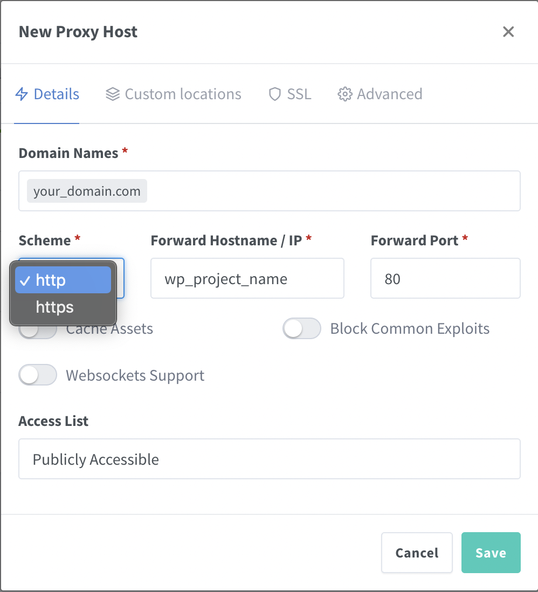
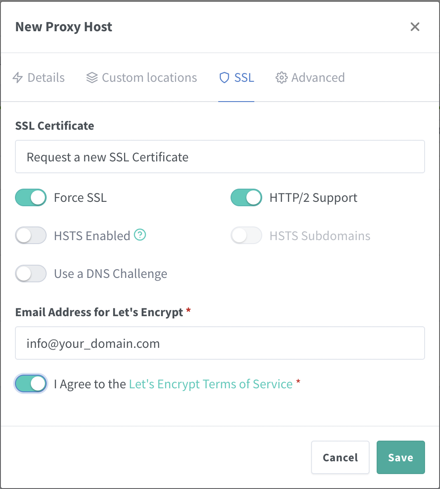

# environment-server
> Docker Environment Server based on Nginx Proxy Manager + Mariadb + Phpmyadmin.

## Pre requisites

docker and docker-compose

## Installation

```sh
git clone https://github.com/cbatista8a/environment-server.git server
```

## Setup

run `mv env.example .env`

Set env variables for your databases connection

Create a custom docker network

run `docker network create your_network_name`

Set your_network_name on docker-compose.yml

```yml
networks:
  default:
    name: your_network_name
    external: true
```

run `docker-compose up -d`

## Use

create other containers on a separate dir

browse to http://your_ip_or_domain_server:81 and create a proxy host whit let's encrypt ssl certificates
and point to an specific service inside container indicating internal port.

> Screenshots





Example of point to a Wordpress container:

```yml
version: "3.9"

services:
  wp_project_name:
    image: wordpress:latest
    volumes:
      - ./src:/var/www/html
    restart: always
    environment:
      - WORDPRESS_DB_HOST
      - WORDPRESS_DB_USER
      - WORDPRESS_DB_PASSWORD
      - WORDPRESS_DB_NAME

networks:
  default:
    name: your_network_name
    external: true
```

First at all: your_domain.com DNS must point to Server IP

If you work in local environment add `127.0.0.1  your_domain.com` to your /etc/hosts 
for correct DNS resolution

On Nginx Proxy Manager Web interface create new "Proxy Host"
and configure your_domain.com to point to container service "wp_project_name"
on port 80 or internal port that your container expose and enable let's encrypt ssl certificate.

Voila, now you can browse to https://your_domain.com and enjoy your app

## Author

[CubaDevOps](https://github.com/cbatista8a) – [cubadevops@gmail.com](mailto:cubadevops@gmail.com)

